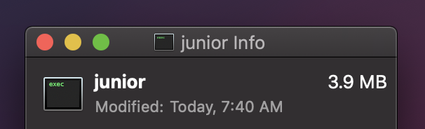

# junior

_A fast, minimalist HTTP server for serving static content._

[![Travis CI: build status][travis-img]][travis]
[![Go Report Card][grc-img]][grc]
[![Docker Hub][docker-img]][docker]
[![MicroBadger][mb-img]][mb]

## Usage

### Docker

```bash
## Run server listening on port 3000, serving locally from "./local/www".
dk run stevenxie/junior -p 3000:80 -v ./local/www:/www/
```

### Standalone

Download executable from
[releases](https://github.com/steven-xie/junior/releases), then run:

```bash
## Run HTTP server on port 4200, serving from "/var/www".
./junior -p 4200 --root /var/www

## For more details:
./junior --help
```

## Implementation

`junior` uses [`valyala/fasthttp`](https://github.com/valyala/fasthttp) behind
the scenes to give itself that extra edge, and is bootstrapped with
[`urfave/cli`](https://github.com/urfave/cli).

The Docker image [`stevenxie/junior`][docker] features a version of `junior`
automatically built with [Travis](https://travis-ci.com) and compressed using
[UPX](https://upx.github.io) to keep it extra light.

## Purpose

I made `junior` because I wanted a really fast, lightweight way of running
a static site behind the [`traefik`](https://traefik.io) reverse proxy.

I had tried [`lighttpd`](https://www.lighttpd.net), but it proved to be
difficult to configure without trailing slashes, and although it was small, it
still felt too complicated and bloated for my use case.

So, I set out to build a custom solution, and this is the result of that:

<br />
<p align="center">
  
</p>

[travis]: https://travis-ci.com/steven-xie/junior
[travis-img]: https://travis-ci.com/steven-xie/junior.svg?branch=master
[grc]: https://goreportcard.com/report/github.com/steven-xie/junior
[grc-img]: https://goreportcard.com/badge/github.com/steven-xie/junior
[mb]: https://microbadger.com/images/stevenxie/juniora
[mb-img]: https://images.microbadger.com/badges/image/stevenxie/junior.svg
[docker]: https://hub.docker.com/r/stevenxie/junior
[docker-img]: https://img.shields.io/docker/pulls/stevenxie/junior.svg
